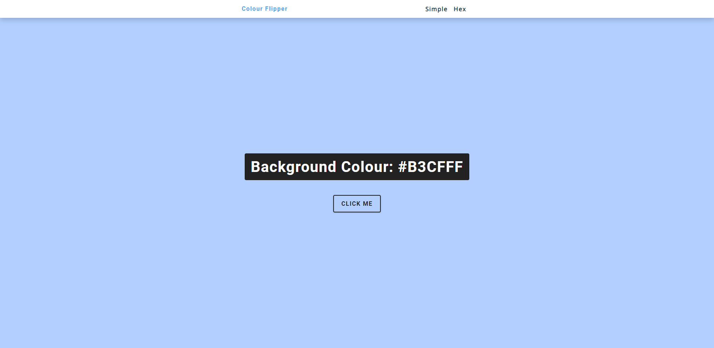

## Table of contents

- [Overview](#overview)
  - [The project](#the-project)
  - [Screenshot](#screenshot)
  - [Links](#links)
- [My process](#my-process)
  - [Built with](#built-with)
  - [What I learned](#what-i-learned)
  - [Continued development](#continued-development)

## Overview

### The challenge

- The aim of this project was to create a button that changes the background colour to a random colour when clicked. There is a simple version which chooses
from an array of 5 colours as well as a hex version which randomises 6 characters (A-F, 0-9) to form a hex code.

### Screenshot



### Links

- Live Site URL: https://aidenm99.github.io/Colour-Flipper/

## My process

### Built with

- Semantic HTML5 markup
- CSS custom properties
- JavaScript

### What I learned

- Use of the += operator

```js
var hex = [0, 1, 2, 3, 4, 5, 6, 7, 8, 9, "A", "B", "C", "D", "E", "F"];


document.querySelector(".btn").addEventListener("click", function(){

  var hexColour = "#";

  for(i=1; i<=6; i++){

  hexColour += hex[getRandomNumber()];

  };
```


### Continued development

- I plan to keep learning JavaScript and compounding my knowledge so that I can build more impressive projects in the future.

